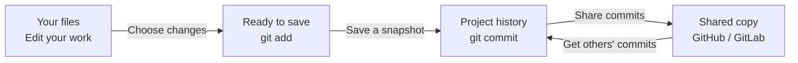

# Beyond basics

Git is a huge topic. Git is flexible, customizable, and very powerful. Most people will never learn everything about Git. Mostly it is because they do not need to.  

## Structure



## Saving changes

* Git ignore (`.gitignore`)
* Git stash

## Inspecting (

* `git status` 
* `git log`
* `git blame`
* `git reflog`

## Undoing Commits & Changes


## Security

Git ignore (`.gitignore`)

## Automation

### Git hooks

client-side:
```txt
pre-commit
prepare-commit-msg
commit-msg
post-commit

post-checkout
pre-rebase
```

server-side:
```
pre-receive
update
post-receive
```

### [> Index](index.md)
