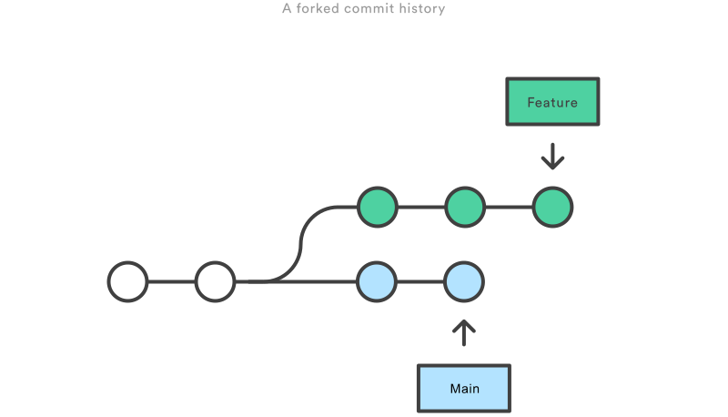

# Creating branches

Used as a safe place to test or work on changes separate to the main (master) branch. Experimental or feature branches.

## Creating a new branch

* Normal: `git branch <branch name>`
* The lazy way: `git checkout -b <new branch name>` Create a new branch and switch to it.
* newer `git switch -c <new branch name>`

## Switching between branches

* `git checkout <branch name>`
* `git switch <branch name>`.

## Deleting branches

* `git branch --delete <branch name>`
* `git branch -D <branch name>`

## Merging branches

* Merge to master
* merge from master to feature branch.

## Rebase

### [> Index](index.md)
