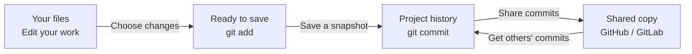
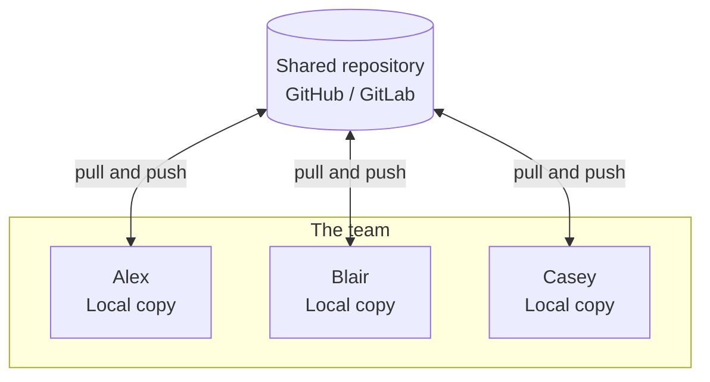
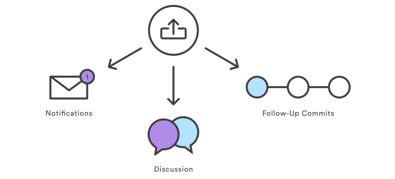

# Collaborating workflows

## Structure

## Using a sentral system to share code

## Updating local repository

Is `git pull` and `git fetch` the same?

## Pull requests

Demo of Github and Gitlab.

### [> Index](index.md)
