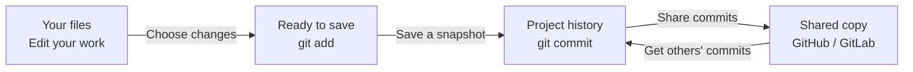
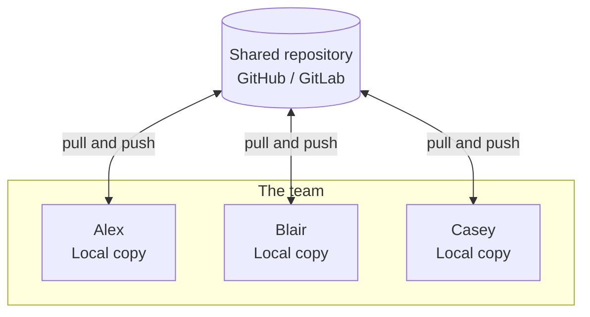

# Collaborating workflows

## Structure

## Using a centralized system to share code

Create MR/PR in your centralized system.

## Updating local repository

Is `git pull` and `git fetch` the same?

## Pull request (PR), Merge request (MR) and Issues

* What is the difference between a pull request (PR) and a merge request (MR)?
* What is the difference between a PR and an issue?

Demo of Github and Gitlab.

### [> Index](index.md)
