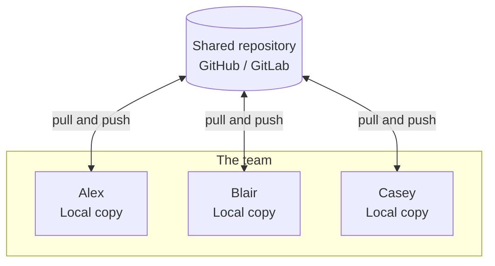

# Collaborating workflows

```mermaid
flowchart TB
    shared[("Shared repository<br/>GitHub / GitLab")]

    subgraph team["The team"]
        direction LR
        alex["Alex<br/>Local copy"]
        blair["Blair<br/>Local copy"]
        casey["Casey<br/>Local copy"]
    end

    shared <-->|"pull and push"| alex
    shared <-->|"pull and push"| blair
    shared <-->|"pull and push"| casey
```

## Pull requests

### [> Index](index.md)
