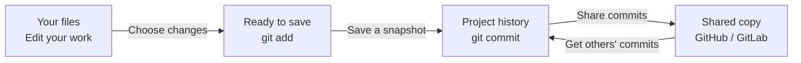

# Presentation topics

## A simple view of Git

Git moves changes from your files into saved snapshots. Those snapshots can then
be shared with other people through a remote service such as GitHub or GitLab.

* [Basics mastered, now what](beyond_basic.md)
* [Branching and merging](branching.md)
* [Work flows](workflows.md)
* [Collaborating workflows](collaborating.md)
* [Problem-solving](problems.md)

### [> Home](../README.md)
