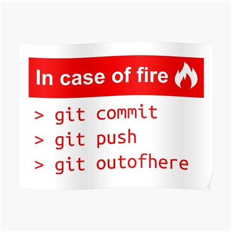

# Security

Nothing is lost before all repositories are lost. Inherit based on Git-distributed design.

You can push to multiple targets (remote repositories). Laptop stolen, not problem `git clone` and you are back.

## Security

Git ignore (`.gitignore`) allows you to ignore files and directories that you don't want to track in Git.

Note: .gitignore —files are cascading. What does that actually mean?

## Did you include a secret in the last commit?

* Change password
* Change access token
* Last resort, remove a rewrite history.
