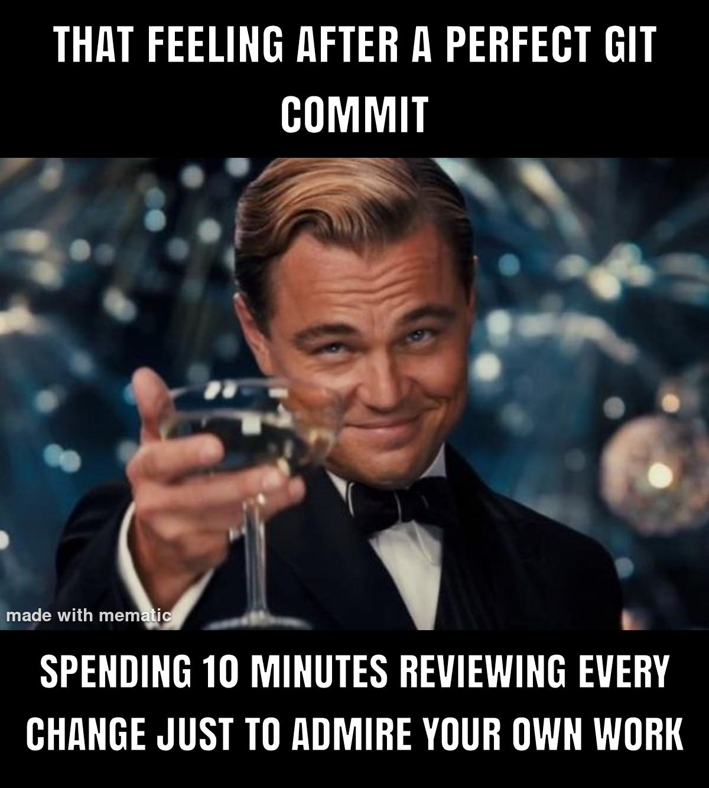
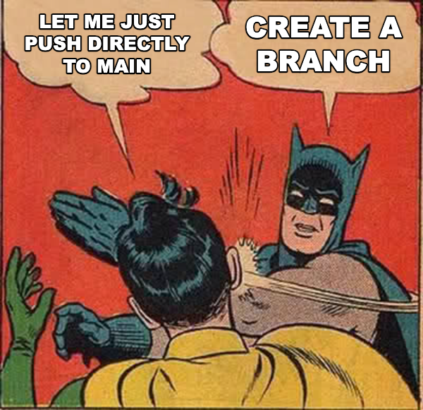
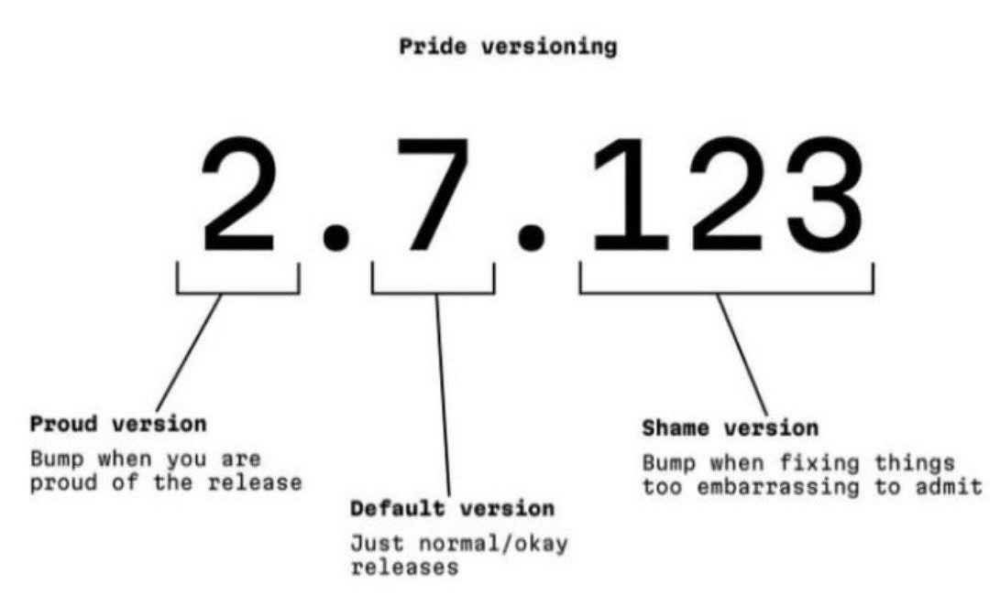

# Workflows

It is easy to get tangled up in all the technical stuff around Git, Git-tools, editors/IDE, but there are some tasks that about no tools can help you with. Human habits.

## Good habits

* Commit early
* Push often
* Pull often
* Pull before pushing

### The commit message

Write the motivation for the change, NOT what you changed.

### Create your own branch

* Keep branches small/narrow
* Squash commits before merging.

### tags (versions)

* Are human-friendly lightweight tags for a longer SHA.
  However, there are sematic versioning rules you should follow.

## Bad habits

* Commits too large.
* Bad commit messages.
* Leave your project in a dirty state.
* Forget to push commits and or branches.

### [> Index](index.md)
